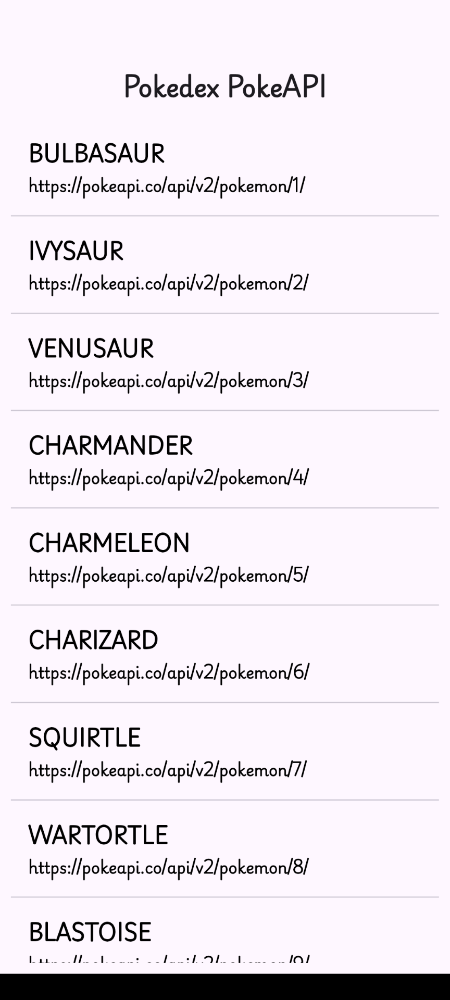
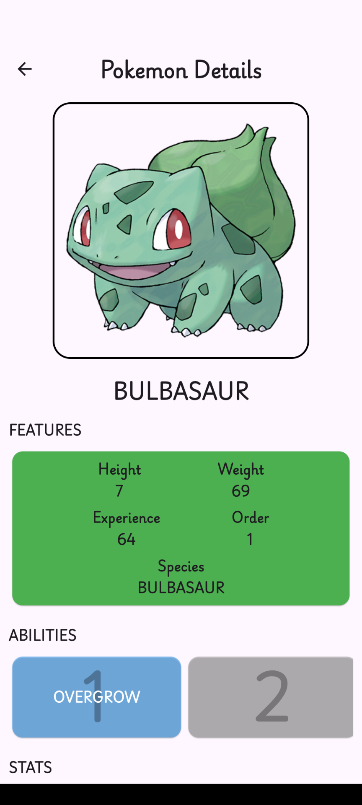

# Pokedex Pokeapi

![coverage][coverage_badge]
[![style: very good analysis][very_good_analysis_badge]][very_good_analysis_link]
[![License: MIT][license_badge]][license_link]

Generated by the [Very Good CLI][very_good_cli_link] 🤖

Pokedex App to show data from Poke API.

---

## Getting Started 🚀

This project contains 1 flavor:

- production

To run the desired flavor either use the launch configuration in VSCode/Android Studio or use the following commands:

```sh
# Production
$ flutter run --flavor production --target lib/main.dart
```

_\*Pokedex Pokeapi works on iOS and Android._


## Features 🎯

- List of Pokemons
- Pokemon Details
    - Name
    - Image
    - Types
    - Abilities
    - Stats
    - Evolutions

## Dependencies 📦

- [Flutter Bloc][flutter_bloc_link]
- [Equatable][equatable_link]
- [Dio][dio_link]
- [Flutter Localizations][flutter_localizations_link]
- [Internationalization][internationalization_link]

## Release APK 🚀

You can download the latest release APK from the ```apk``` folder in the root of the project.

## Screenshots 📸

|  |  |
|:---:|:---:|
| Home | Details |

## License 📄

This project is licensed under the MIT License - see the [LICENSE](LICENSE) file for details.


[coverage_badge]: coverage_badge.svg
[flutter_localizations_link]: https://api.flutter.dev/flutter/flutter_localizations/flutter_localizations-library.html
[internationalization_link]: https://flutter.dev/docs/development/accessibility-and-localization/internationalization
[license_badge]: https://img.shields.io/badge/license-MIT-blue.svg
[license_link]: https://opensource.org/licenses/MIT
[very_good_analysis_badge]: https://img.shields.io/badge/style-very_good_analysis-B22C89.svg
[very_good_analysis_link]: https://pub.dev/packages/very_good_analysis
[very_good_cli_link]: https://github.com/VeryGoodOpenSource/very_good_cli
[dio_link]: https://pub.dev/packages/dio
[equatable_link]: https://pub.dev/packages/equatable
[flutter_bloc_link]: https://pub.dev/packages/flutter_bloc
